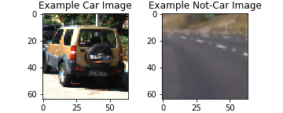
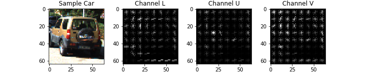
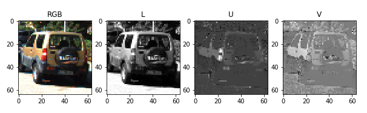
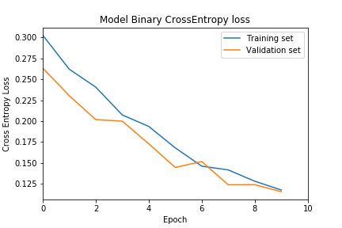
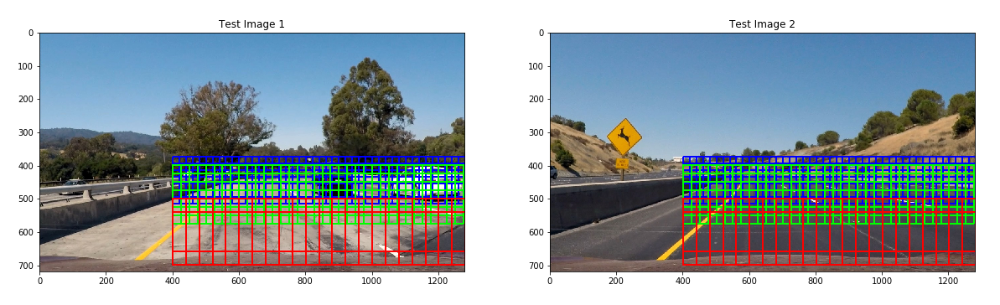
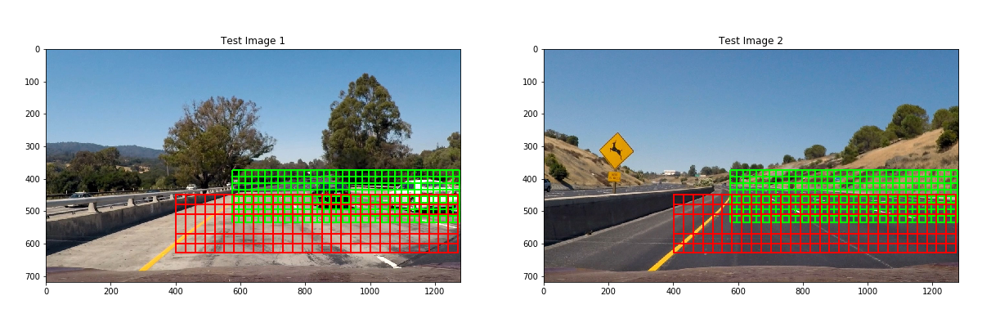
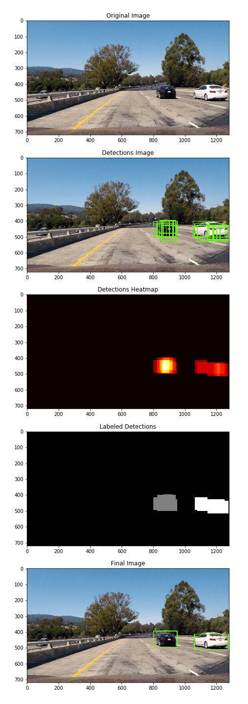
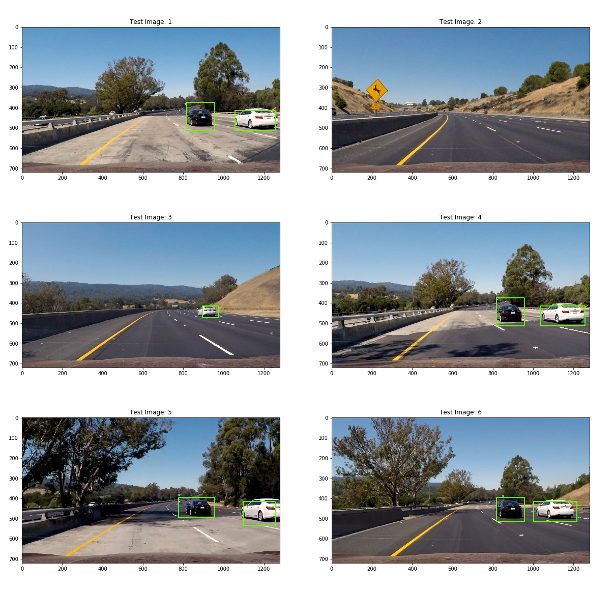
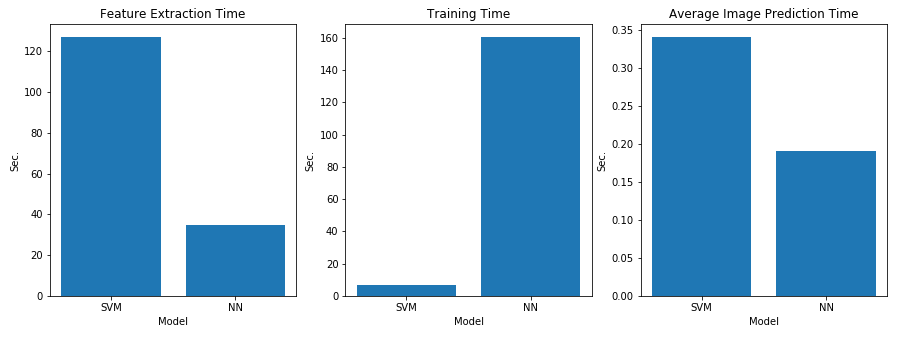

# Vehicle Detection
Comparison of vehicle detection using color/HOG features and LeNet-5

## **1. Introduction**

This project explores the problem of vehicle detection using a Linear Support Vector Machine (SVM) implemented using Scikit-Learn and a Neural Network approach implenting a LeNet-5 architecture using Keras over Tensorflow. The approaches are compared for speed, accuracy and simplicity. This project was done as part of Udacity's Self Driving Car Nanodegree program.

This repo consists of the following project files:
* [SVM Pipeline](./Vehicle-Detection-SVM.ipynb)
* [Neural Net Pipeline](./Vehicle-Detection-NN.ipynb)
* [Trained Models](./models)

## **2. Feature Extraction**

### 2.1 Project Data

The training data available for the project consisted of a combination of the GTI vehicle image database, the KITTI vision benchmark suite as well as samples extracted from the Udacity provided project test videos. The images were labeled as 'cars' or 'not cars', hence this was a binary classification problem. The car images consisted of vehicle rears whereas the not-car images consisted of background images typically encountered on roadways. The characteristics of the data set were as follows:

* Number of car images: 8792
* Number of not-car images: 8968
* Total # of images: 17760
* Image size: 64x64, RGB

The image below shows an example of one of the training car and not-car images:

<p align="center">

</p>

### 2.2 SVM Training Features

The SVM training features consisted of the raveled spatially binned image pixel values, the binned histogram color values and the image HOG (Histogram of Oriented Gradients) features concatenated into a single column vector.  

The 64x64 RGB image was first converted into the ```LUV``` colorspace where the chromacity of an image is defined by the U and V pixel values and the luminance by the L pixel values. This helps isolate the effects of a varying brightness in the training and test data into a single channel. The image was the resized to 32x32 pixels and raveled using the ```bin_spatial()``` function to give a feature vector length of:

``` Spatial Features: 32 x 32 x 3 = 3072```

Next, the ```color_hist()``` function was used to compute the color histograms for each channel in the input image and bin them into 32 discrete color bins ranging from pixel values of 0 - 255. The histograms for each channel were concatenated to give a feature vector length of:

``` Color Histogram Features: 32 x 3 = 96 ```

Finally, the HOG features for the image were calculated using the ```get_hog_features()``` function. The following parameters were used to extract the hog features

```
orient = 9  # HOG orientations
pix_per_cell = 8 # HOG pixels per cell
cell_per_block = 2 # HOG cells per block
hog_channel = "ALL" # Can be 0, 1, 2, or "ALL"
```
The values of the parameters above were selected after experimenting with different combinations to achieve the optimum results. Given that the input image size was 64x64, a ```pix_per_cell``` value of 8 allowed for sufficient granularity in the resulting gradients. Similarly, there wasn't a substantial performance gain achieved by increasing the granularity of the HOG orientation greater than 9 (or bins of 40 degrees). This is attributed to the fixed shape of vehicles where the gradient lines of the defining features are expected to be almost horizontal (top and bottom of vehicle rear & rear lights) or almost vertical (sides of vehicle). The image below shows a visualization of the hog features for each of the image channels in LUV space.

<p align="center">

</p>

The resulting feature vector size is:

```HOG Features: channels x orient x cell_per_block grid size x cell_per_block x cell_per_block = 3 x 9 x (7 x 7) x 2 x 2 = 5292```

This results in a total feature vector length of:

```Feature vector length = Spatial + Color + HOG = 3072 + 96 + 5292 = 8460```

The final feature vector was then scaled and normalized using Scikit-Learn's ```Standard_Scaler()``` object to provide a final training data set of zero mean and unit variance.

### 2.3 Neural Network Training Features

The neural network training features were significantly simpler than the ones used for the linear SVM. The training dataset was first converted to ```LUV``` colorspace and then resized to 32x32 pixels to reduce the number of training parameters in the final model. Normalization of the dataset was done using a Lambda layer within the model as defined in the next section. The image below visualizes the LUV colorpsace in grayscale for a test car image.

<p align="center">

</p>

## **3. Model Architecture & Training**

### 3.1 Linear Support Vector Machine

The feature vectors for the 17760 training images were then extracted using the ```extract_features()``` function. The total time taken to extract the features described above was 127.03 seconds. The training data was then shuffled and 20% was split off to use as a test set after training. The model selected for the classifier was Scikit-Learn's ```LinearSVC()```. The total time taken to train the classifier was 7.05 sec. and a test accuracy of 99.41% was achieved. The trained classifer was saved using Pickle and is available in the repository files [here](./models).

### 3.2 Neural Network

The decision to use a neural network was motivated by earlier projects in Udacity's Self-Driving Car Nanodegree where various architectures were implemented for a range of tasks from traffic sign classification to behavioral cloning to drive an autonomous vehicle in a simulator. The challenge in using a neural network for this task was to keep the time required for a forward pass as low as possible while maintaining a good level of accuracy, therefore the LeNet-5 architecture was selected. The model was built using Keras and is described below.

| Layer         | Output Shape       | Param # | Comments                                                           |
|---------------|--------------------|---------|--------------------------------------------------------------------|
| Normalization | (None, 32, 32, 3)  | 0       | Scale by 255 and subtract 0.5 to normalize within range [-0.5,0.5] |
| Conv1         | (None, 28, 28, 6)  | 456     | 6 5x5 kernels, 1x1 stride, valid padding, ELU activation           |
| MaxPool1      | (None, 14, 14, 6)  | 0       | 2x2 stride                                                         |
| Conv2         | (None, 10, 10, 16) | 2416    | 16 5x5 kernels, 1x1 stride, valid padding, ELU activation          |
| MaxPool2      | (None, 5, 5, 16)   | 0       | 2x2 stride                                                         |
| Flatten       | (None, 400)        | 0       |                                                                    |
| FC1           | (None, 120)        | 48120   | ELU activation                                                     |
| Dropout1      | (None, 120)        | 0       |                                                                    |
| FC2           | (None, 84)         | 10164   | ELU activation                                                     |
| Dropout2      | (None, 84)         | 0       |                                                                    |
| Output        | (None, 1)          | 85      | Sigmoid activation                                                 |

There are a couple of notable differences between the standard LeNet-5 architecture and the one used above. Firstly, the last FC layer has a single output node with a sigmoid activation function to obtain a probability of the classification result. An adam optimizer was used to initalize and gradually decrease the learning rate during training and a ```binary_crossentropy``` loss was used since this is a binary classification problem. The metric was set to ```accuracy```.

The time required to read in the images and prepare the data for training was a total of 35.03 seconds, significantly less than the time required for the SVM. The model was trained using a batch size of 512 images for 15 epochs and an ```EarlyStopping()``` callback with a patience of 1 was used to terminate training if the validation loss in subsequent epochs reduced by less than 0.01. Once again, 20% of the data was split off and used as a validation set. The total training time for the model was 160.38 seconds and was terminated at Epoch 9. The figure below shows the training and validation loss.

<p align="center">

</p>

The trained model is available [here](./models).

## **4. Object Localization**

### 4.1 Sliding Windows

A sliding window approach was then used to extract image patches and feed them into either the SVM or Neural Net to perform classification. A window size of 80x80 pixels was used with a 75% overlap in both the x and y directions. It was found that the SVM classifier required a larger number and scale of windows to perform more accurately. The parameters for each of the models are described below.

```
SVM:
window_scale = (1.0, 1.25, 2)
x_start_stop = [400, 1280]
y_start_stop = [[375, 520], [400, 580], [500, 700]]
Total windows/image: 330

Neural Net:
window_scale = (1.0, 1.5)
x_start_stop = [[575, 1280], [400, 1280]]
y_start_stop = [[375, 550], [450, 650]]
Total windows/image: 238
```
The search limits of the image were defined to keep the sliding windows within the roadway of the direction of travel of the vehicle to avoid any unnecessary false positives. The images below visualize the sliding windows for the SVM and neural net respectively.

SVM windows:
<p align="center">

</p>

NN windows:
<p align="center">

</p>

### 4.2 Search Optimization
The sliding window approach is relatively slow since an image patch needs to be extracted, processed and fed into the model for each window position, scale and ultimately sequence of frames when the video is analyzed. Performing this task with the SVM and without any sort of optimization resulted in an average image processing time of >2 seconds/image which was not practical.

#### 4.2.1 HOG Subsampling
The HOG subsampling approach allowed for efficient extraction of image patches and features from the test images. In particular, the HOG features were computed once for the entire frame and then array slicing was used to obtain the relevant HOG features. The same slicing parameters were then fed into the functions responsible for extracting the spatially binned and color histogram features. This process was repeated for the various scales of image windows required. It is important to note that the window scales need to be adjusted for HOG subsampling to maintain the same scales visualized above. This was necessary since the HOG subsampling approach downsamples the image while maintaining the same window size to achieve a scaling effect. The window size for the HOG subsampling is 64x64 (the same size as the training images), hence a scaling factor of 80/64 is used for each of the window scales defined above. Details of this approach can be found in the ```find_cars()``` function in the SVM pipline notebook. 

This reduced the average processing time of an image from input to prediction to 0.34 seconds. This is still not good enough for real-time detection but is a significant improvement over the unoptimized case. 

#### 4.2.2. Image Views & Batch Prediction
The neural network approach also needed significant optimization to be practical. The unoptimized approach of extracting a single image patches and performing prediction on one sample at a time resulted in an average test image processing time of >3 seconds. The neural net was optimized using two methods.

First, the Scikit-Image function ```view_as_windows()``` was used to create views of the image. This allowed for efficient extraction of the required patches from the images by simply defining the step sizes and search extents of the image. This function had to be called on each image channel at a time after which the results were stacked, reshaped into the correct dimensions and resized to 32x32 pixels for input into the classifier. Details of this processing can be found in the ```create_views()``` function of the NN pipeline notebook.

The second optimization technique was to perform batch prediction on the views created for the entire frame at once as opposed to looping over each view one at a time. Details of the implementation can be found in the ```search_windows()``` function of the NN pipeline notebook.

The combination of these techniques reduced the average processing time of a test image to 0.19 seconds which is a significant reduction over the base case and also faster than the SVM approach. However, this is still not fast enough for real-time detection.

### 4.3 Heatmaps & False Positives

The SVM and NN both correctly detected and classified the vehicles in the test images. Multiple detections were returned for each vehicle and these needed to be grouped into a single bounding box and thresholded to eliminate any potential false positives in the search area. Identical code was used for both approaches since this method was independent of the type of classifier used.

The ```add_heat()``` function was first used to convert the positive detections into a heatmap. A threshold was then applied using the ```apply_threshold()``` function to eliminate regions of the search results which may be outside the body of the vehicle. Finally, the thresholded heatmap was labeled using SciPy ```label()``` function and the results were plotted on the test image. A visualization of this pipeline is available in the images below.

<p align="center">

</p>

In the case of the NN, a prediction threshold was also applied to discard any predictions below a certain confidence level. This allows for further elimination of false positives and was another parameter that could be tuned. The images below visualize the final detection results of the NN.

<p align="center">

</p>

Finally, an ```ImageProcessor()``` class was implemented to capture the heatmaps from successive frames when analyzing video using the ```heatmaps_list``` attribute which is a deque of maximum length defined by the ```smooth_count``` attribute. This allowed for more robust weaning of false positives that may apper in a few frames. A ```vehicle_detection()``` method was also implemented for this class which recieves an image frame extracted from the video and performs all the necessary pre-processing, detection and post-processing to draw the smoothed, thresholded bounding boxes on each image. The details of the ```vehicle_detection()``` method for each model can be found in their respective notebooks.  

## **5. Results**

The SVM approach used a final heatmap threshold value of 8 over 10 consecutive frames along with the parameters described in earlier sections. The video output of the pipeline can be found [here](https://youtu.be/nW4-ouvLMLM).

The NN approach used a final heatmap threshold of 9 over 15 consective frames and a confidence level of 60%. The video output of the pipeline can be found [here](https://youtu.be/BtA2LCyARxA).

The NN approach appears to be more robust than the SVM approach, particularly as the object size gets smaller (more distant cars). This is evident around the 26-28 second mark when the white vehicle is furthest away and the SVM momentarily loses the vehicle. The NN does not lose track of either vehicle throughout the duration of the video. This, however, may also be indicative of additional tuning required to get better detection via the SVM whereas the NN seems to perform relatively well for this test video with minimal tuning.

Here is a comparison of the speed of the two models for various tasks:
<p align="center">

</p>

The analysis above shows that the LeNet-5 architecture is faster than the SVM on the test video, however, this may also be a result of the higher number of windows used in the SVM to get better accuracy. It was also noted during this exercise that it is much simpler to build and train a neural network to perform the classification task as opposed to manually crafting the feature vector to be used by the SVM.

## **6. Reflections**

The speed of the SVM approach could  be improved by performing batch predictions instead of looping through predicitons. Additionally, the creation of the ```windows``` array in the NN approach could be vectorized as well to futher improve the speed.

However, even with these additional optimizations, a major limitations of both these approaches is the inability to do real-time detection which requires an image processing time of approximately 30 ms to do at least 30 fps. The current image processing time for the neural network approach is 190ms. An extension of this project may involve the use of YOLOv2 to perform faster localization and classification of objects. Additionally, it is noted that the ```cv2.Rectangle()``` routine used to plot the bounding boxes may take up to 20 ms which would need to be significantly reduced for real-time detection.

This pipeline was only tested on the project video provided as part of the Udacity project repository which is well illuminated. Future work would involve testing this pipeline in poorly illuminated or night-time conditions to test it's robustness. It is suspected that the pipeline may not perform as well under those conditions.
